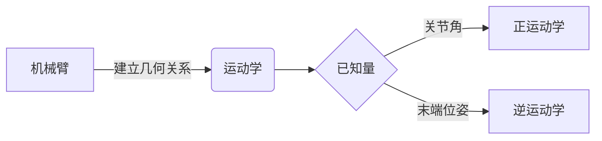

# 小型关系图与从属树

日期：2026-09-14。实现：`web/knowledge-relations.js`、`web/knowledge-relations.css`。

## 组件接口

`renderRelation(source)` 和 `renderTree(source)` 均立即返回 HTMLElement。组件通过 `data-render-state="pending|ready|error"` 标记状态；等待 `element.renderComplete` 可取得最终元素。完成时触发冒泡事件 `knowledge:rendered`，`detail` 含 `kind` 与 `state`。树和无效输入可能同步完成，调用者应优先等待 Promise。

关系图使用 `flowchart` 或 `graph`，方向支持 TD、TB、BT、LR、RL；最多 12 个节点、24 条连线。节点编号以英文字母或下划线开头，后续允许数字。支持普通方框、圆角、圆形、菱形、六边形、子程序、圆柱等常见括号，以及实线、虚线、粗线、双向线和纯文字连线标签。每个标签不超过 100 字符。一个图需要至少一条连线。暂不支持 subgraph、样式声明和新的 `@{...}` 节点语法。



树只表达实际上下级关系。使用一致的空格缩进，最多 4 层、24 项，每项不超过 160 字符；没有从属关系的并列项用普通列表。树的分支默认展开，可通过鼠标或键盘收起。

```tree
机械臂
  运动学
    正运动学
    逆运动学
  动力学
```

## 本地依赖与来源

采用官方 `@mermaid-js/tiny` **11.12.0**，MIT 许可证。项目原有依赖中未找到可复用 Mermaid。Tiny 构建包括本次所需流程图能力，不需要额外布局引擎或运行时 CDN。固定版本可复现本次组件行为；官方在线文档可能随新版更新。

- [Mermaid 官方用法](https://mermaid.js.org/config/usage.html)：渲染 API、Tiny 构建和 `securityLevel: strict` 的行为。
- [Mermaid 官方流程图语法](https://mermaid.js.org/syntax/flowchart.html)：节点形状、方向和连线标签。
- [Mermaid 官方配置定义](https://mermaid.js.org/config/schema-docs/config.html)：`htmlLabels`、文本及连线规模限制。
- [固定版本 npm 元数据](https://registry.npmjs.org/@mermaid-js/tiny/11.12.0)。包地址：`https://registry.npmjs.org/@mermaid-js/tiny/-/tiny-11.12.0.tgz`。
- 包 integrity：`sha512-hDNmHuDdAhSQ4IraAh42Ck/wZ1m788vDlbH8Lgjh6FrrO06Tw1S8Lc8U3w3aGfDXeUu2dLTv6xsTYi0uNzxajg==`。
- 浏览器文件：`web/vendor/mermaid/mermaid.tiny-11.12.0.js`，1,734,571 字节。
- 浏览器文件 SHA-256：`082c50b982106e4332e6eef4da54b50897036c80ea29ef2753956c1bba5a14d4`。
- 许可证：`web/vendor/mermaid/LICENSE`。

首次遇到合法关系图时载入本地脚本；普通笔记和树无需下载 Mermaid。离线缓存需要包含组件 JS、组件 CSS、上述 Mermaid JS 三个路径。

## 输入和输出边界

原文先经过小语法解析器，再以组件内部节点 ID 重建 Mermaid 源码，不将任意用户源码送入 Mermaid。初始化指令、front matter、click/href/callback、链接和样式配置、HTML、控制字符等不属于语法。普通 `%%` 注释可略过，`%%{...}%%` 指令直接拒绝。

Mermaid 固定使用 `securityLevel: 'strict'`、`htmlLabels: false`、`startOnLoad: false`。渲染串行进行，临时测量容器在每次完成后移除。组件不调用 Mermaid 的事件绑定函数。

返回的 SVG 经 DOMParser 解析，再仅用允许的 SVG 图形/文字节点和属性重新创建。script、foreignObject、a、image、style、事件、href 和外部资源地址不会复制。所有 ID 重写为每页、每图唯一 ID；marker 引用只保留同幅图的本地 fragment。颜色和节点文字对齐由本地样式指定。HTML 内容不参与树渲染，树标签全部写入 textContent。

失败时显示一行说明及纯文本源码。图比手机宽时仅组件内部横向滚动。

## 本次验收与维护经验

环境：Windows、Node.js 24.13.0、本机 Edge、项目已有 Playwright。运行 `node web/qa/knowledge-relations-check.mjs`，结果写入 `docs/note-standard-v5/qa/relations-check.json`，桌面和 390px 截图位于同目录。

本次检查包括 5 种合法流程图、13 组危险或错误源码、8 项树检查，覆盖节点/箭头、重复图 ID、节点内中文文字范围、键盘折叠、移动端滚动。测试阻断所有非本机请求，最终没有外部请求或浏览器错误。

一次实际发现：删除 Mermaid 内嵌样式后，Tiny 11.12.0 的节点文字失去居中；该构建使用 `.node .label text`，不能套用其他版本的 `.nodeLabel` 选择器。已在本地 CSS 指定 `.node text { text-anchor: middle }`，并加入中文标签位于节点内的断言。保留允许的几何属性和本地 marker 引用，重新创建 SVG 时可同时保住箭头和纯 SVG 标签。
