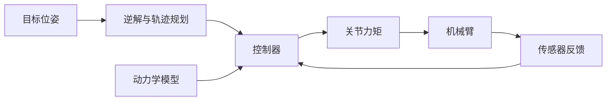

# 机器人运动学、动力学与控制基础

下面按串联机械臂（如六轴工业机器人）为主线，讲解机器人运动学、动力学与控制基础。

- **运动学**：描述位置、姿态、速度与关节变量的关系。
- **动力学**：描述关节力矩与运动、重力的关系。
- **控制**：根据目标轨迹和反馈，计算电机指令。



## 一、机器人运动学

### 1. 位姿表示

末端位姿包括**位置**和**姿态**：

- 位置：$p=[x,y,z]^\mathrm{T}$。
- 姿态：旋转矩阵 $R$，或四元数、欧拉角。
- 齐次变换：把旋转和平移写在一起。

$$
T=\begin{bmatrix}R&p\\0&1\end{bmatrix}
$$

### 2. 正运动学

已知关节角 $q$，求末端位姿 $T(q)$。各连杆的变换依次相乘：

$$
{}^0T_6={}^0T_1\,{}^1T_2\cdots{}^5T_6
$$

[DH 变换](concept:dh)用四个参数描述相邻连杆。标准形式为：

$$
{}^{i-1}T_i=
\begin{bmatrix}
\cos\theta_i&-\sin\theta_i\cos\alpha_i&\sin\theta_i\sin\alpha_i&a_i\cos\theta_i\\
\sin\theta_i&\cos\theta_i\cos\alpha_i&-\cos\theta_i\sin\alpha_i&a_i\sin\theta_i\\
0&\sin\alpha_i&\cos\alpha_i&d_i\\
0&0&0&1
\end{bmatrix}
$$

它把坐标系 $i$ 中的坐标转换到坐标系 $i-1$。

- $a_i$：连杆长度。
- $\alpha_i$：连杆扭角。
- $d_i$：沿关节轴的偏距。
- $\theta_i$：绕关节轴的转角。

### 3. 逆运动学

已知目标位姿 $T_d$，求关节角：

$$
q=\operatorname{IK}(T_d)
$$

- 可能[无解](concept:nosol)：目标超出可达范围。
- 可能多解：同一目标对应肘上、肘下等姿态。
- 选解：结合关节限位、避障和运动距离。

例如抓取同一个工件，手肘可以朝上，也可以朝下。

### 4. [雅可比矩阵](concept:jac)

雅可比把关节速度映射为末端速度：

$$
\begin{bmatrix}v\\\omega\end{bmatrix}=J(q)\dot q
$$

- $v$：末端线速度。
- $\omega$：末端角速度。
- $\dot q$：关节速度。

**奇异位形**：雅可比低于通常的秩，部分运动方向暂时丢失。例如平面两连杆完全伸直时，末端瞬时不能沿杆方向移动。

### 5. 轨迹规划

- 关节空间：直接规划各关节的位置、速度。
- 笛卡尔空间：先规划末端路径，再求关节轨迹。
- 常用轨迹：多项式、梯形速度、S 曲线。
- 约束：关节限位、速度、加速度和力矩。

## 二、机器人动力学

### 1. [标准动力学方程](concept:dynamics)

自由运动、忽略摩擦时：

$$
M(q)\ddot q+C(q,\dot q)\dot q+g(q)=\tau
$$

- $M(q)$：惯性矩阵，对称正定。
- $C(q,\dot q)\dot q$：科氏力与离心力项。
- $g(q)$：重力项。
- $\tau$：电机施加的关节力矩。

同一条抓取轨迹，运动越快、负载越重，所需力矩通常越大。

### 2. [拉格朗日法](concept:lagrange)

从动能 $T$ 和势能 $V$ 出发：

$$
L=T-V,\qquad
\frac{d}{dt}\frac{\partial L}{\partial\dot q_i}
-\frac{\partial L}{\partial q_i}=\tau_i
$$

写能量 → 对各关节求导 → 整理成动力学方程。

### 3. [牛顿—欧拉法](concept:newton)

1. 基座 → 末端：递推各连杆速度、加速度。
2. 末端 → 基座：递推各连杆受力与关节力矩。

计算流程清楚，适合实时求逆动力学。

## 三、机器人控制

### 1. 关节 PID

设位置误差 $e=q_d-q$。加入重力补偿：

$$
\tau=K_pe+K_i\int e\,dt+K_d\dot e+g(q)
$$

- **比例**：根据当前偏差纠正位置。
- **积分**：累积偏差，消除持续的静差。
- **微分**：根据误差变化抑制振荡。

### 2. [计算力矩控制](concept:ctc)

用动力学模型计算力矩，再用 PD 反馈修正误差：

$$
\tau=M(q)(\ddot q_d+K_d\dot e+K_pe)
+C(q,\dot q)\dot q+g(q)
$$

在上述动力学模型匹配时：

$$
\ddot e+K_d\dot e+K_pe=0
$$

$K_p,K_d$ 取对角正定矩阵，理想误差指数收敛。

### 3. 接触任务

- **位置控制**：让末端沿目标轨迹运动。
- **力控制**：调节接触力，如压紧、打磨。
- **阻抗控制**：规定接触力与位移、速度等的关系。

抓取后装配，既要对准位置，也要避免接触力过大。

## 学习建议

- 快速回顾[线性代数](concept:linear)：矩阵、旋转、秩。
- 看控制过程。B 站搜索：`PID 动画演示`
- 了解仿真。B 站搜索：`Gazebo 入门`

一个小型仿真项目：

```tree
机械臂仿真
  模型
    几何与惯量
  轨迹
    位置与速度
  控制器
    反馈与力矩
```

## 继续探索

- 工业机器人最早被用来做什么？
- “机器人”这个词最初表达了怎样的想象？
- 机器人进工厂后，工人的工作怎样改变了？
